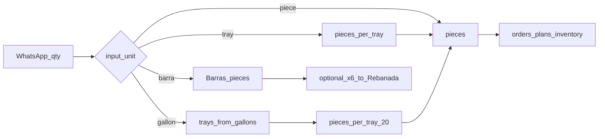

# Pan Dulce production units (gallon → tray → piece)

## Goal

Teach the system the bakery’s real production language so WhatsApp-style inputs (`3 de fino`, `20 cortadillos`, `120 barras`) convert to **sellable pieces**—the unit already used in orders, plans, and inventory—without a new page or module.

Mission slug: **`production-plan`** (extends Production Center / bake loop reference data; no new top-level surface).

## Owner facts (authoritative — seed these)

| Product / family | Input language | Conversion |
|---|---|---|
| Concha | gallon dough batch | Owner estimate: **3 gal → ~44 trays → 880 pieces** ⇒ **20 pcs/tray**, **≈14.667 trays/gal** (store `trays_per_gallon = 44/3` + `pieces_per_tray = 20`) |
| Fino | gallon dough batch | Same gallon language; dough yields the **5** catalog SKUs: Elotes, Cuerno Azucar, Tostado, Nopal, Chamuco |
| Barras | whole barras | 1 order unit = **1 piece** of product `Barras` |
| Barra (Rebanada) | cut from whole barra | **1 Barras → 6 Barra (Rebanada)** |
| Cortadillos | trays | **1 tray → 33 pieces** (was 30) |
| Colchón | trays | **1 tray → 32 pieces** |
| Budín | trays | **1 tray → 40 pieces** |

Working defaults (seed now; PM can override in UI):

- Default **`pieces_per_tray = 20`** for sheet-tray products without a cut override.
- Concha: `batch_unit = gallon`, trays_per_gallon = `44/3`, pieces_per_tray = `20` → 3 gal = 880 pieces.
- Fino: **same gallon→tray→piece geometry as concha** until PM gives a different yield; **split across the 5 fino SKUs evenly (20% each)** when expanding a “fino” gallon order—provisional; ask PM.

## What exists today (do not reopen)

- 31 Pan Dulce products; membership = `product_lines.name = 'Pan Dulce'`.
- Ops quantities are **INT pieces** (`daily_order_items`, `production_plan_*`, `product_inventory_days`).
- Order quick-add standards live in `pan_dulce_product_quantity_standards` / `pan_dulce_quantities.php`—**piece defaults for standing apply**, not production yields.
- Dough batch math via `weight_grams` + `standard_batch_dough_grams` exists but is **unset** for Pan Dulce; leave that path alone for this slice (gallon/tray yields are a separate pack model).
- Fri bake covers Sat–Mon (`includes/production_cadence.php`). Closest produced snapshot: **2026-08-16** (many SKUs at 200/120/100; specialties at 12)—use only as sanity check, not seed truth.

## Schema (next migration `052_…`)

**1. `product_pack_yields`** (per sellable product)

- `product_id` PK → `products(id)` CASCADE
- `input_unit` ENUM/`VARCHAR`: `piece` | `tray` | `gallon` | `barra` (barra = whole loaf of Barras)
- `pieces_per_input` DECIMAL(12,4) NULL — for tray/piece/barra direct: Cortadillos 33, Colchón 32, Budín 40, Barras 1
- `trays_per_gallon` DECIMAL(12,4) NULL — Concha/Fino family geometry when stored per product (optional if dough table holds it)
- `pieces_per_tray` INT NULL — default 20 when sheet-tray path used
- `source_product_id` NULL — Barra (Rebanada) points at Barras for cut-from
- `cut_ratio` DECIMAL(12,4) NULL — Rebanada: `6` (pieces of this product per 1 source Barras)
- `notes` VARCHAR/TEXT — e.g. “cortadillo was 30; now 33”
- `updated_at`

**2. `product_aliases`**

- `id`, `alias` UNIQUE (normalized lower/trim), `product_id` FK, optional `notes`
- Seed spelling bridges: pudin/pudín→Budín, queiquito(s)→Quequitos, gragea/grajea→Grajea, colchones→Colchón, concha(s)→Conchas, yoyo/yoyó→Yo-yo, pingüino→Pinguino, etc.
- Do **not** invent products for missing names; aliases only where a catalog row exists. Log gaps as Homebase notes / PM list.

**3. `dough_type_pack_yields`** for Concha + Fino gallon geometry

- `dough_type_id` PK, `trays_per_gallon`, `pieces_per_tray`, `notes`
- Fino expansion uses dough_type Fino membership + even split until PM overrides with a mix table later.

## Helpers (`includes/product_pack_yields.php`)

- `bakery_pack_normalize_alias($raw) → product_id|null`
- `bakery_pack_to_pieces(PDO, product_id|dough_type, qty, unit) → int pieces` (round half-up; document)
- `bakery_pack_fino_split(gallons) → [product_id => pieces]` even 1/5 of total fino pieces
- `bakery_pack_barra_to_rebanada(barra_count) → rebanada pieces` using cut_ratio 6
- Never change stored order/plan columns away from pieces; conversion is at **input / display assist** boundaries only.

## UI — close loop on existing screen

Extend `pan_dulce_quantities.php`:

- Keep existing **standard_quantity** (order quick-add) column.
- Add editable pack-yield columns: input unit, pieces/tray or pieces/input, trays/gallon, notes; show derived “1 gallon ≈ N pieces” read-only.
- Alias list subsection or compact alias editor for Pan Dulce only.
- i18n keys in `lang/en.php` + `lang/es.php`.
- CSRF + role checks as today.

No WhatsApp parser UI in this slice—structures + conversion API + admin edit only.

## Seed + sanity (not auto-rewrite live orders)

- Seed confirmed rows from owner table above.
- Cross-check only: a sample Fri WhatsApp block converted with these rules vs Sat–Mon demand magnitudes / 2026-08-16 produced round numbers (200≈10×20 trays)—report in handoff; **do not** rewrite `daily_order_items`.
- Note: today’s standing Cortadillos/Colchón/Budín quantities look like **pieces** (~10 std), while WhatsApp uses **trays**—conversion matters when ingesting tray language; standing standards stay piece-based unless owner later asks to change meaning.

## Tests

- New `tests/run_product_pack_yield_tests.php` on `bakerysf_test`:
  - 1 tray Cortadillos → 33; Colchón → 32; Budín → 40
  - 1 Barras → 1; 2 Barras → 12 Rebanada via cut
  - 3 gal concha → 880 pieces (±1 if rounding)
  - 3 gal fino → 880 total split 176 each across 5 SKUs (if same yield as concha)
  - alias pudin → Budín
- Run via test-gate skill; also i18n if lang touched.

## Out of scope this slice

- Adding missing catalog products (corazón, bolillo, tamalero, …).
- Filling `weight_grams` / ingredient batch grams.
- Auto-parsing email/WhatsApp into orders.
- Changing Production Center commit/confirm loops.

## PM / owner question list (running)

1. Confirm fino gallon yield equals concha (3 gal → 44 trays → 880 pcs), or provide fino-specific trays/gal.
2. Confirm even 20% split across Elotes / Cuerno Azucar / Tostado / Nopal / Chamuco, or provide the usual mix ratios per gallon.
3. Concha color variants (“azules”, “moradas”) and “corazón”: separate products, or attributes of Conchas?
4. Picón gallon language: same as concha/fino? Which SKUs (Liso, Cocol, Gusano, Tortuga, Roles de Canela) and split?
5. Guayaba / Nuez / Yo-yo / Puerco / Taco / Grajea / Polvorones: gallon, tray, or piece in WhatsApp?
6. Quequitos: tray size / pieces per tray?
7. Marianas, Yoyós, Pingüino with no number: default tray count or “make standard”?
8. Barras “120”: confirm always whole Barras pieces (not trays). *(Owner already said whole Barras; keep as confirm-with-PM if numbers look huge.)*
9. When customer wants rebanadas, do they order Barra (Rebanada) pieces, or Barras with a cut instruction?
10. Specialty produced-at-12 on 8/16 (Pastel, Mariana, …): dozen tray or fixed 12-piece unit?
11. Map or add: bolillo, tamalero, payaso, niños, cocadas, sevillanas, alfajores, conos, orejas, papa, de queso, panitos chapines.
12. Should standing `standard_quantity` for Cortadillos/Colchón/Budín stay in pieces, while a future order-entry path accepts trays?

Pin lasting answers in Homebase `--column=decided`; keep open items as `note --kind=question`.

## Implementation todos (when approved)

1. Add migration 052: `product_pack_yields` + `dough_type_pack_yields` + `product_aliases`
2. Seed owner-confirmed yields
3. Add `includes/product_pack_yields.php` conversion + alias normalize
4. Extend `pan_dulce_quantities.php` + i18n
5. Add `tests/run_product_pack_yield_tests.php` and run test gate
6. Log PM question list + provisional fino-split decision to Homebase
